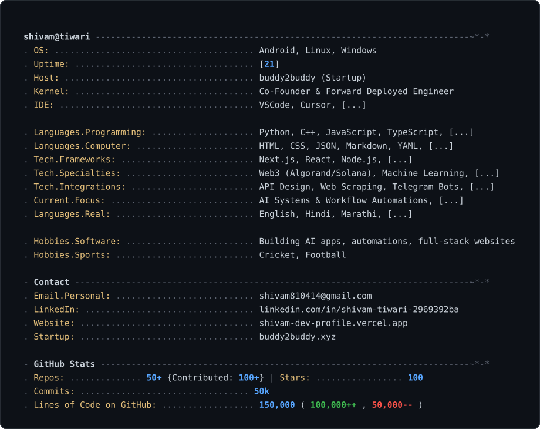

  

## Showcase

### AI & Intelligent Agents

- [Calling-Agent](https://github.com/tiwarishivam-pixel/Calling-Agent) - Real-time AI voice mentor built with OpenAI LLMs, Vapi orchestration, Twilio telephony, and ElevenLabs voice synthesis for automated mentorship calls.
- [senri-ai](https://github.com/tiwarishivam-pixel/senri-ai) - AI-orchestrated career intelligence platform leveraging LLM workflows, agentic automation, and contextual reasoning to simulate real hiring processes.
- [mailGenerator-2.0](https://github.com/tiwarishivam-pixel/mailGenerator-2.0) - AI-powered cold mail generator with LLM-based text generation, resume analysis, and role-specific prompt engineering.
- [rag-support-agent](https://github.com/tiwarishivam-pixel/rag-support-agent) - RAG-powered customer support agent for intelligent, context-aware responses.
- [rag-bot](https://github.com/tiwarishivam-pixel/rag-bot) - Chatbot with RAG implementation using LangChain for document-grounded conversations.
- [QuizAI](https://github.com/tiwarishivam-pixel/QuizAI) - AI-powered quiz platform that generates personalized quizzes, evaluates answers, and identifies weak areas with targeted study material.
- [jarvis.AI](https://github.com/tiwarishivam-pixel/jarvis.AI) - AI-powered personal assistant built with JavaScript.
- [Smart-Ai-Staff](https://github.com/tiwarishivam-pixel/Smart-Ai-Staff) - AI staff automation system built with Python.

### Full-Stack Applications

- [e-commerce](https://github.com/tiwarishivam-pixel/e-commerce) - Full-stack e-commerce platform with authentication, admin dashboard, secure payments, and order tracking. Built with Next.js and PostgreSQL.
- [hospitalManagement](https://github.com/tiwarishivam-pixel/hospitalManagement) - Multi-user hospital management system with bed/blood availability, appointment booking, and reviews. Built with Next.js, TypeScript, and MongoDB.
- [mentora](https://github.com/tiwarishivam-pixel/mentora) - Full-stack MERN platform connecting students and teachers with AI-powered tools and attendance/community management.
- [ZenTask](https://github.com/tiwarishivam-pixel/ZenTask) - Modern Kanban-style project and task management platform with a powerful dashboard for team productivity.
- [ReelsPro](https://github.com/tiwarishivam-pixel/ReelsPro) - Video content platform built with TypeScript.
- [Nexus-AI](https://github.com/tiwarishivam-pixel/Nexus-AI) - Central hub for AI-driven interactions, built with Flutter.

### Automation & Workflow

- [n8n_projects](https://github.com/tiwarishivam-pixel/n8n_projects) - Collection of n8n automation workflows for various use cases.
- [repoforge](https://github.com/tiwarishivam-pixel/repoforge) - Repository management and automation tool built with Python.
- YT-Clip - YouTube clip extraction and processing tool. *(Private)*
- postpilot - Social media post scheduling and automation platform. *(Private)*
- ai-code-reviewer - AI-powered automated code review tool. *(Private)*

### Blockchain / Web3

- [Aawaaz](https://github.com/tiwarishivam-pixel/Aawaaz) - Decentralized journalism platform using blockchain, decentralized identity, and zero-knowledge proofs for secure, anonymous reporting with verifiable ownership.
- Rolly-Polly - Smart contract project built with Solidity. *(Private)*
- Skill-chain - Blockchain-based skill verification and credentialing system. *(Private)*
